<div align="center">

<br>

</div>

# cheempunkzed

```yaml
alias: Shukurjon
online_identity: cheempunkzed
role:
  - Developer
  - Digital Explorer

interests:
  - Artificial Intelligence
  - Android
  - Linux
  - Cyberpunk
  - Philosophy
  - Future technologies
```

> "We are the universe trying to understand itself."

I explore technology from the inside:
from algorithms and neural networks to operating systems and machine behavior.

---

## 🧬 About me

- 🤖 Interested in AI and autonomous systems
- 📱 Android enthusiast
- 🐧 Linux enjoyer
- ⚙️ Interested in low-level technologies
- 🌌 Exploring science, philosophy and the future of humanity


---

# 🛠️ Tech Stack

### Languages

<div>


</div>


### Platforms & Tools

<div>


</div>


---

# 🚀 Projects & Experiments

## 🧠 Artificial Intelligence

Experiments with:
- Local AI models
- Automation
- Personal assistants
- Neural networks


## 📱 Android

Working with:
- Android applications
- System customization
- Performance optimization
- Mobile Linux environments


## 🐧 Linux

Exploring:
- Termux
- Containers
- Custom environments
- System internals


---

# 🌌 Philosophy

Beyond code, I like exploring questions about:

- Consciousness
- Artificial intelligence
- Evolution
- Space
- The future of civilization

Code is just another way for matter to organize itself and create new realities.

---

# 📊 GitHub Stats

<div align="center">


<br><br>



<br><br>


</div>


---

# 🐍 Contribution Snake

<div align="center">


</div>


---

# 🌐 Connect

<div align="center">

<a href="https://t.me/cheempunkzed">

</a>

<a href="https://instagram.com/cheempunkzed">

</a>

<a href="https://youtube.com/@cheempunkzed">

</a>

<a href="https://pinterest.com/cheempunkzed">

</a>

</div>


---

<div align="center">


<br>


</div>
